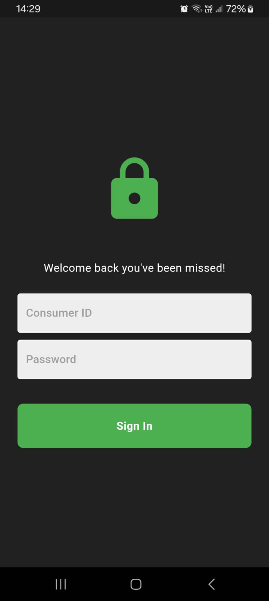
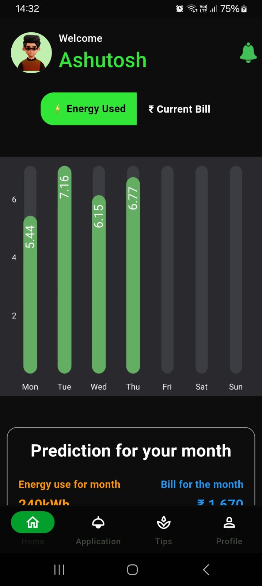
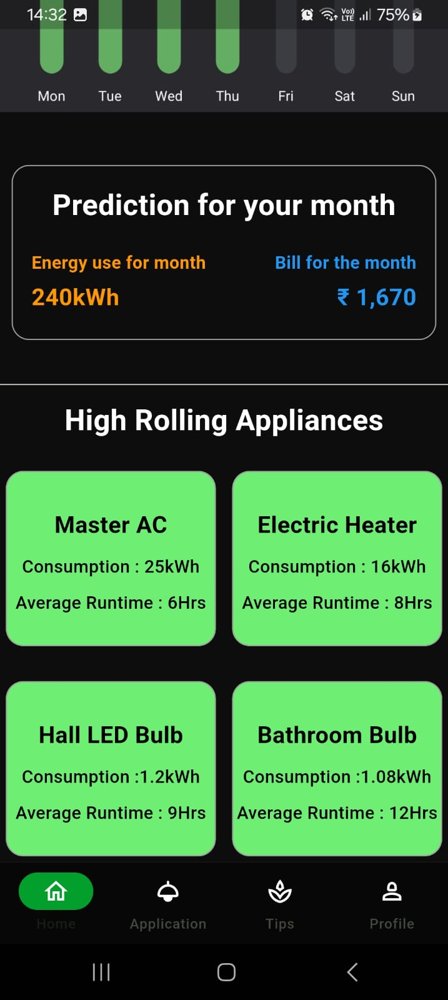
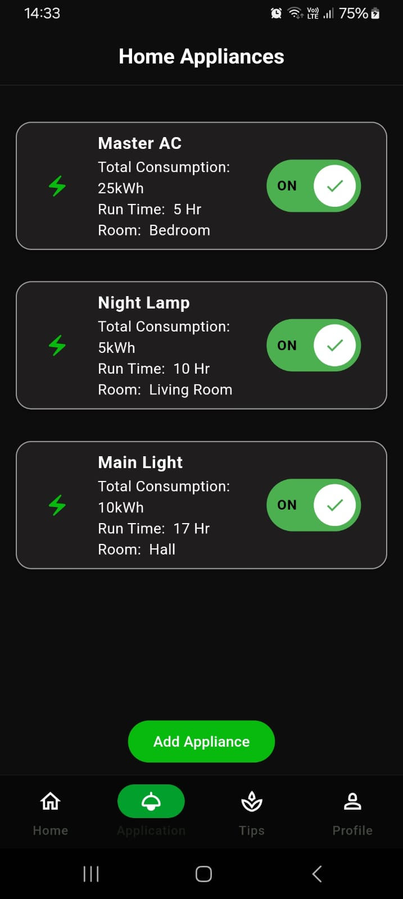
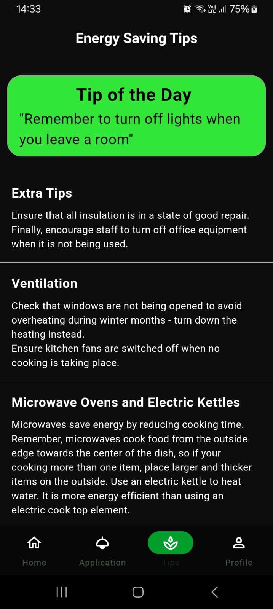
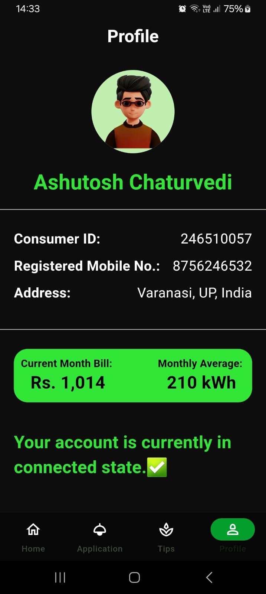

# ⚡ Smart Energy Tracker App

A smart, intuitive mobile application designed to help users monitor and manage household energy consumption efficiently. With real-time tracking, detailed charts, and smart tips, this app empowers users to save energy, track bills, and make informed choices about their appliance usage.

---

## 🚀 Features

### 🔐 User Authentication
- Secure **login and signup** functionality.
- Authentication ensures personalized access and secure data handling.

### 📊 Dashboard Overview
- Displays a **summary of appliance usage**.
- Highlights **top energy-consuming appliances**.
- Includes a **bar chart** for daily energy consumption.
- Real-time updates for easy analysis and insights.

  
  

### 🔌 Appliance Tracking
- Users can **add new appliances** to monitor energy usage.
- Each appliance’s consumption is tracked and visualized.
- Helps identify which devices are consuming the most energy.

  
  

### 💡 Energy Saving Tips
- A dedicated section with **smart energy-saving tips**.
- Personalized suggestions based on user consumption patterns.
- Aims to reduce unnecessary usage and electricity bills.

### 📈 Consumption Charts
- Interactive charts showing **daily units consumed**.
- Visualizes energy trends over time.
- Includes **estimated bill calculation** based on usage.

### 🧾 Billing Insights
- Displays **estimated monthly bill amount**.
- Shows **total units consumed** to date.
- Helps in budgeting and managing energy usage.

### 👤 User Profile
- Shows **user details** and current energy status.
- Displays total **bill amount and energy units consumed**.
- Neatly organized and easily accessible.

---

## 🛠 Tech Stack

- **Flutter** – Cross-platform mobile app development  
- **Firebase** – User authentication and data storage  
- **Chart Libraries** – For data visualization  

---

## 🧠 Why This App?

This app is built with the vision of making energy monitoring accessible and actionable for every household. Whether you're aiming to reduce bills, minimize your carbon footprint, or simply stay informed, this smart tracker provides all the tools you need.

---

